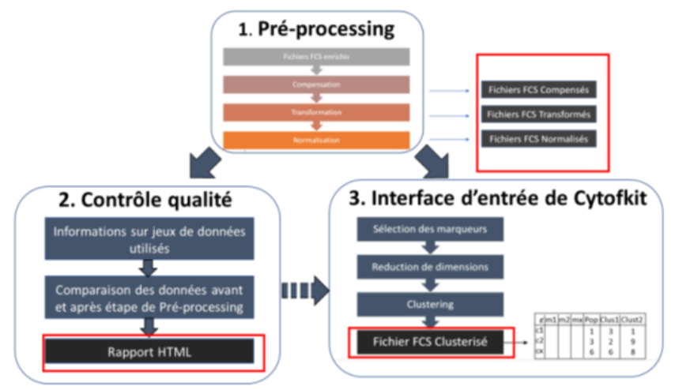

# 3CKIT

The 3CKIT is a shiny interface for performing pre-processing of FCS data, their quality control and serving as a new input interface to the Cytofkit Tool used for clustering and visualization of data clustering

## Pre-processing 

The preprocessing step is divided into 3 steps to compensate, transform and normalize the FCS data

### Compensation
Compensation corrects the effects of overlapping emission spectra of fluorescent antibody markers. (See Figure 10)

### Transformation
Data transformation is essential for visualization and data modeling. The main transformations commonly used in cytometric analysis are arcsinh, cytoasinh and logicle. (See Figure 11)
In these formulas, x corresponds to the variable to be transformed (the expression of the markers of each cell), the values ​​a, b, c, e, m, p, w and T are parameters affecting the transformation function. All these transformations are implemented in R especially with the Flowcore package

### Normalization

In order to avoid contamination of sorting by undesired cells and to ensure the reliability of the results of cell cycle measurements, it is important not to take into account cell aggregates during cell sorting in cytometry. The method used is based on the possibility of analyzing the profile of the signal collected, its area, its height or its passage time (flight time, time of flight, TOF, width depending on the machine). By using combinations of these parameters, it is possible to
distinguish doublets singlets. The methods used differ according to the type of cytometric data (flow cytometry or mass).
For flow cytometry, the flowAI package is used. It proceeds by the use of algorithms for the detection of anomalies. The general approach underlying this method consists of three main steps to verify and eliminate anomalies resulting from abrupt changes in flow rate, instability of signal acquisition, and outliers in events (cells).
For each analyzed file, the application generates a summary of the quality assessment from the steps mentioned. (See Figure 12) For mass cytometry data, the CATALYST [25] package is used. CATALYST is a pipeline that includes standardization using ball standards and unicellular deconvolution. It offers an implementation of the
ball-based normalization. The identification of singlets (used for normalization) as well as cell doublets (to be deleted) is automated [25] (see Figure 12).

## Quality control

Quality control allows you to view markers independently and in co-expression as a correlation matrix in order to have an overview of the dataset before any analysis. The QC also makes it possible to compare the data before and after normalization and gives additional information on data acquisition (see Figure 13)

## Cytofkit Interface

The configuration interface of the cytofkit calculations (clustering, dimension reduction) makes it possible to choose appropriate parameters for each data set. First, the interface is used to set the pre-processing of the data and to combine several FCS files before the analysis. (See Figure 14)
Secondly, it is important to choose the markers. In cytometry, the parameters used to make the clustering correspond to the markers of the cells. But not all markers are used for this purpose. The data are generally clustered using phenotypic markers and visualization is done on phenotypic and functional markers. Once the markers are chosen, the interface proposes the choice of clustering among the DensVM, FlowSOM, PhenoGraph and ClusterX methods that allow automatic detection of cell subpopulations. (See figure 15)
Then, the interface proposes the choice of the methods allowing to visualize the data of big dimension, to present the types of cells marked with a specific color, thanks to a linear transformation such as PCA or a nonlinear reduction such as the t-SNE. (See figure 16)
All these parameters chosen, the user can finally start the calculations. For this purpose the application generates a directly executable R script which then allows to launch Cytofkit for data exploration and interpretation.

